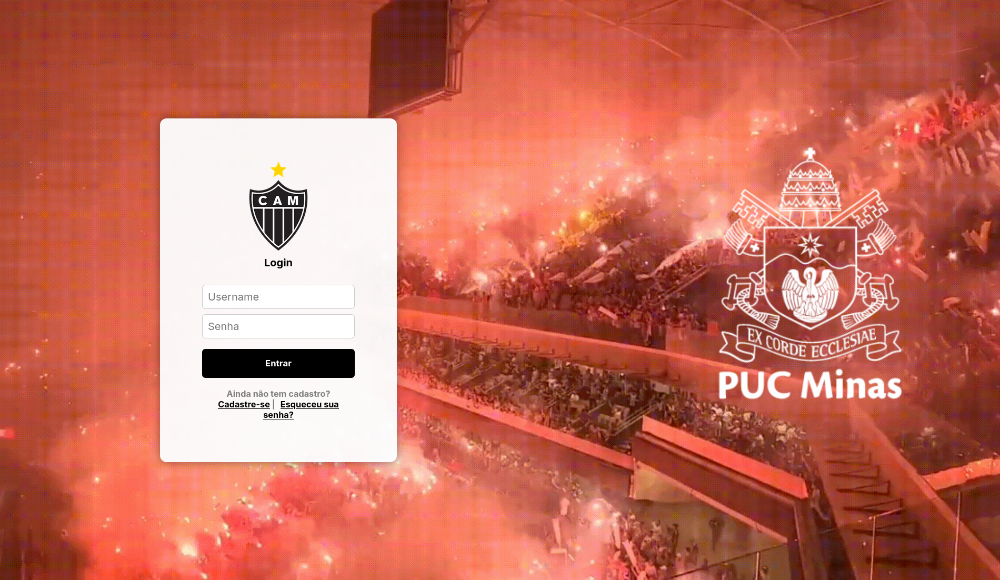
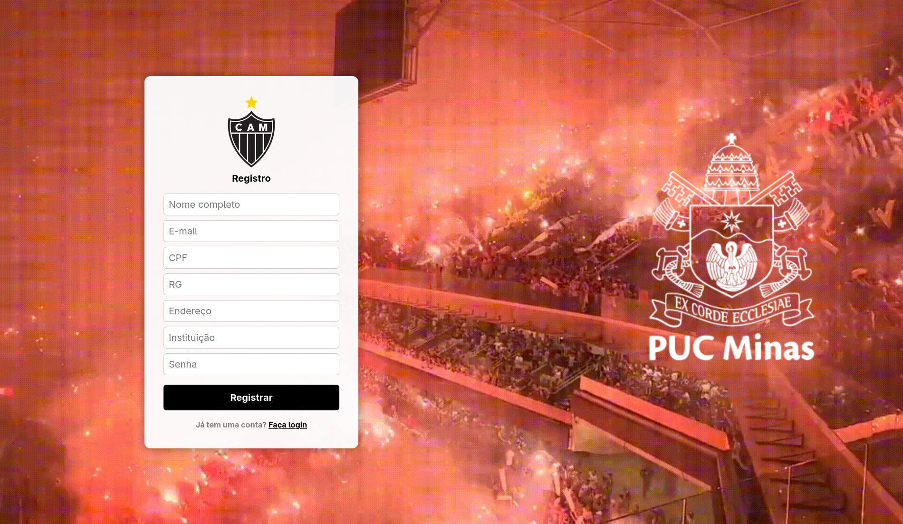

# Telas de Login e Cadastro com temática do Atlético Mineiro

### Dependências Utilizadas

- Java 25
- Maven
- Spring Boot
- Spring Web
- Thymeleaf

---

### Endpoints

- `GET /login`
    - Retorna a página HTML de login

  

- `GET /register`
    - Retorna a página HTML de cadastro

  
---

### Como Executar a Aplicação

##### Pré-requisitos
- JDK 25
- Maven
- Git

##### Passo a Passo:

1. Clonar o repositório e entrar na pasta do projeto:
   ```bash
   git clone https://github.com/joaom-abreu/DIAW
   cd TelaLogin/TelaLogin

2. Compilar e executar:
   ```bash
   mvn clean install
   mvn spring-boot:run

3. Testar os Endpoints:

    - http://localhost:8080/login
    - http://localhost:8080/register